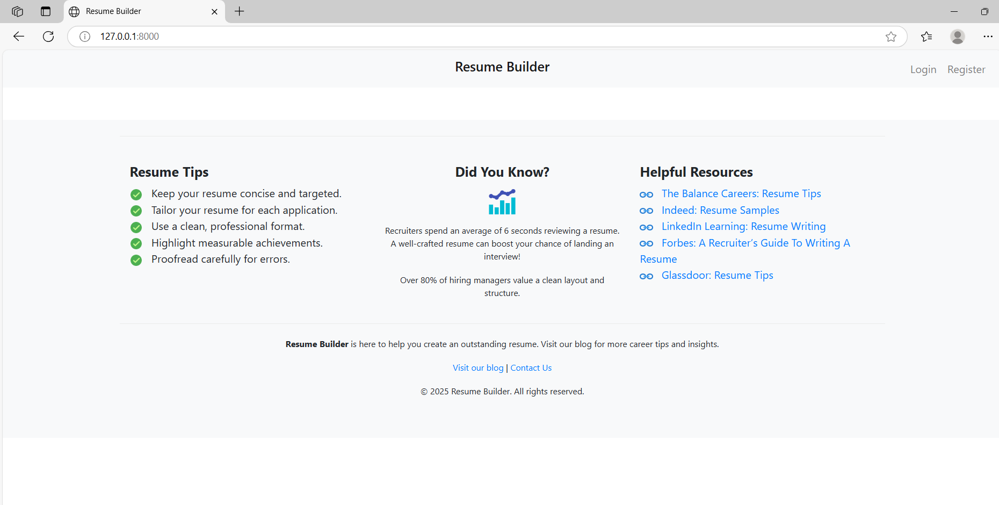

# Resume Builder

**Resume Builder** is a Django-based web application which i made for praticing and learning mroe about django framework and other related tools. With an intuitive form interface and helpful resume tips, this project aims to streamline the process of building a standout resume for job applications.



## Table of Contents

- [Features](#features)
- [Technologies Used](#technologies-used)
- [Project Structure](#project-structure)
- [Installation and Setup](#installation-and-setup)
- [Usage](#usage)
- [PDF Generation](#pdf-generation)
- [Customization](#customization)
- [License](#license)
- [Acknowledgements](#acknowledgements)

## Features

- **User Authentication:**  
  Register, log in, and log out securely.
  
- **Resume Creation:**  
  Fill out a comprehensive form to add personal details, education, work experience, skills, and more.

- **Dashboard:**  
  A personalized dashboard for logged-in users to create or view their resume.

- **Responsive Design:**  
  Clean, mobile-friendly interface built with Bootstrap.

- **PDF Download (Optional):**  
  Generate a downloadable PDF of your resume using PDF generation tools (configurable if desired).

- **Helpful Tips & Insights:**  
  The base template includes resume tips, statistics, and resource links to guide users in building a great resume.

## Technologies Used

- **Backend:** Django 5.x, Python 3.10+
- **Frontend:** HTML, CSS, Bootstrap 4.3.1
- **PDF Generation:** (Optional) Alternatives such as WeasyPrint or xhtml2pdf
- **Form Handling:** Standard Django forms (manual rendering without Crispy Forms)
- **Static Assets:** Online images (from Icons8 and other sources) and local static files

## Project Structure

```
resume_builder/
├── manage.py
├── resume_builder/          # Main project folder
│   ├── __init__.py
│   ├── settings.py          # Configuration file (includes installed apps, static settings, etc.)
│   ├── urls.py              # Project-level URL mappings
│   └── wsgi.py
└── resume/                  # The Django app
    ├── __init__.py
    ├── admin.py
    ├── apps.py
    ├── forms.py             # Contains the ResumeForm for input validation and styling
    ├── models.py            # Defines the Resume model
    ├── tests.py
    ├── urls.py              # App-level URL mappings
    ├── views.py             # Contains views for authentication, dashboard, resume creation, and viewing
    └── templates/
         └── resume/
             ├── base.html  # Base template (with navigation, footer with tips and resources)
             ├── home.html  # Landing page
             ├── login.html # User login page
             ├── register.html  # User registration page
             ├── dashboard.html # Dashboard for authenticated users
             ├── create_resume.html  # Form to create or edit a resume
             └── view_resume.html    # Display the generated resume
```

## Installation and Setup

1. **Clone the Repository:**

   ```bash
   git clone https://github.com/Optimized-Brain/resume-builder.git
   cd resume-builder
   ```

2. **Create and Activate a Virtual Environment:**

   On Windows:
   ```bash
   python -m venv env
   env\Scripts\activate
   ```
   On macOS/Linux:
   ```bash
   python3 -m venv env
   source env/bin/activate
   ```

3. **Install Dependencies:**

   ```bash
   pip install -r requirements.txt
   ```
   
   If you’re using PDF generation, install the required library (e.g., for xhtml2pdf):
   ```bash
   pip install xhtml2pdf
   ```

4. **Apply Migrations:**

   ```bash
   python manage.py makemigrations
   python manage.py migrate
   ```

5. **Run the Development Server:**

   ```bash
   python manage.py runserver
   ```

6. **Open the Application:**

   Navigate to [http://127.0.0.1:8000/](http://127.0.0.1:8000/) in your browser.

## Usage

- **Registration/Login:**  
  New users can register using the registration page. Existing users can log in.

- **Dashboard:**  
  Once logged in, users are redirected to the dashboard where they can either create a new resume or view an existing one.

- **Resume Creation:**  
  Fill out the form in the "Create Resume" section. All fields (personal details, about, education, work experience, skills) are captured.

- **View Resume:**  
  The "View Resume" page displays the generated resume. Navigation tips and resources are also shown in the footer.

- **PDF Download (Optional):**  
  A link (if enabled) allows users to download their resume as a PDF. You can configure or remove this feature if desired.

## PDF Generation

This project includes an optional PDF generation feature. Two common alternatives are:

- **xhtml2pdf:** Converts HTML to PDF using ReportLab under the hood.  
   
In the views, the PDF generation view renders the resume template to an HTML string and then converts it to PDF.

## Customization

- **Styling:**  

- **Templates:**  
  Edit the templates in `resume/templates/resume/` to suit your desired layout. The base template includes a footer with helpful resume tips and external links.

- **External Resources & Images:**  
  The base template uses online images (from Icons8) for icons. You can replace these URLs with your own if needed.

## Contributing

Contributions are welcome! Feel free to fork the repository and submit a pull request. When contributing, please follow these guidelines:

1. Fork the repository.
2. Create a new branch for your feature or bug fix.
3. Commit your changes with clear messages.
4. Push to your branch and open a pull request.
5. Ensure your code is well-documented and tested.

## License

This project is licensed under the [MIT License](LICENSE).

## Acknowledgements

- Special thanks to the [Django documentation](https://docs.djangoproject.com/) and [Bootstrap](https://getbootstrap.com/) for their great resources.
- Icons provided by [Icons8](https://icons8.com).

---
